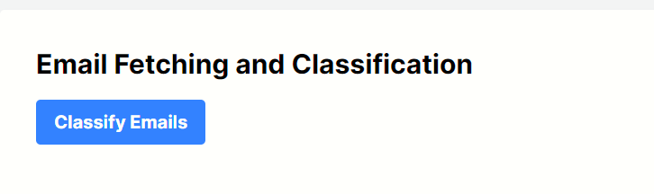

# Email Classification and Automatic Reply to Emails ✨🚀


_alt text_

## Overview

Email Classification and Automatic Reply to Emails is a web application that uses Next.js with NextAuth for authentication (using Google as the provider), the Google Gmail API for fetching emails, and Gemini open-ai api key and automated replies. Additionally, the website incorporates Framer Motion to add smooth transitions and animations.

## Prerequisites

Before getting started, ensure you have the following installed:

- [Node.js and npm](https://nodejs.org/)
- [Git](https://git-scm.com/)
- Google Cloud Platform Account with API access enabled: [Create Credentials](https://developers.google.com/workspace/guides/create-credentials)
- OpenAI API Key: [Sign Up](https://ai.google.dev/gemini-api/docs/api-key)

## Getting Started

Follow these steps to set up and run the project locally.

### Clone the Repository

```bash
git clone https://github.com/ashish07-07/REACHINBOX-AI/tree/main/ai-email
```

### Install Dependencies

Navigate to the project directory and install the required dependencies:

```bash
npm install
# or
yarn install
```

### Set Up Your Secrets and Environment Variables

1. Copy the example environment file:
   ```bash
   cp .env.local.example .env.local
   ```
2. Fill in your secrets in the `.env.local` file.

### Run Your Project Locally

Start the development server:

```bash
npm run dev
# or
yarn dev
```

Your Next.js application should now be running locally at [http://localhost:3000](http://localhost:3000).

## Additional Resources

- [Next.js Documentation](https://nextjs.org/docs)
- [Google Cloud Documentation](https://cloud.google.com/docs)
- [OpenAI API Documentation](https://platform.openai.com/docs)
